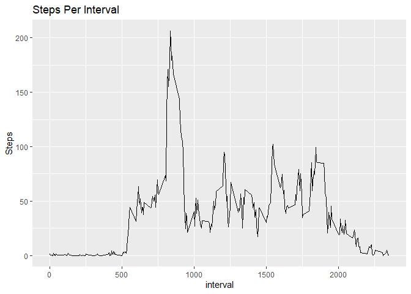

## Loading and preprocessing the data

#Initial data download

The data is initially downloaded from here

```r
url <- "https://d396qusza40orc.cloudfront.net/repdata%2Fdata%2Factivity.zip"
destfile <- "download.zip"
if(!file.exists(destfile)) {

        download.file(url, 

                      destfile = destfile, 

                      method = "curl")

        unzip(destfile, exdir = ".")

}
act <- read.csv("activity.csv")
```

Converting date format:

```r
library(lubridate)
```

```
## 
## Attaching package: 'lubridate'
```

```
## The following objects are masked from 'package:base':
## 
##     date, intersect, setdiff, union
```

```r
act$date <- ymd(act$date)
```


## What is mean total number of steps taken per day?

I group the dates by day and use ggplot to make the histogram

```r
library(dplyr)
```

```
## Warning: package 'dplyr' was built under R version 3.6.3
```

```
## 
## Attaching package: 'dplyr'
```

```
## The following objects are masked from 'package:lubridate':
## 
##     intersect, setdiff, union
```

```
## The following objects are masked from 'package:stats':
## 
##     filter, lag
```

```
## The following objects are masked from 'package:base':
## 
##     intersect, setdiff, setequal, union
```

```r
library(ggplot2)
```

```
## Warning: package 'ggplot2' was built under R version 3.6.3
```

```r
#Sum total steps per day
act_day <- act %>%  # specify dataframe
        group_by(date)   %>%
        summarize(d_sum = sum(steps, na.rm = TRUE))

        
qplot(d_sum, data = act_day, main = "Frequency of Steps each Day", xlab = "Steps")
```

```
## `stat_bin()` using `bins = 30`. Pick better value with `binwidth`.
```

<!-- -->

```r
mean(act_day$d_sum)
```

```
## [1] 9354.23
```

```r
median(act_day$d_sum)
```

```
## [1] 10395
```

```r
#plot(act_day, main="Total Step per Day", ylab ="Steps per day", xlab="Date", lwd=5, col="red", abline(h=m))
```


## What is the average daily activity pattern?

To look at the average daily pattern I group by interval to compare steps on a more granular level

```r
act_int <- act %>%  
        group_by(interval) %>%  
        summarize(i_mean = mean(steps, na.rm = TRUE))

ggplot(data=act_int, aes(x=interval, y=i_mean)) + geom_line() + ggtitle("Steps Per Interval") +
ylab("Steps")
```

<!-- -->

```r
act_int[act_int$i_mean==max(act_int$i_mean),]
```

```
## # A tibble: 1 x 2
##   interval i_mean
##      <int>  <dbl>
## 1      835   206.
```

## Imputing missing values
Count how many NAs are in data frame:

```r
sum(is.na(act))
```

```
## [1] 2304
```

Since I've already calculated the mean for the intervals (act_int), I will use these to fill in the NA values.


```r
act1 <- merge(act, act_int)

act1$steps[is.na(act1$steps)] <- act1$i_mean[is.na(act1$steps)]
```

Now I'll compare with with the original calculation with NAs


```r
act_day1 <- act1 %>%  # specify dataframe
        group_by(date)   %>%
        summarize(d_sum1 = sum(steps, na.rm = TRUE))

qplot(d_sum1, data = act_day1, main = "Frequency of Steps each Day", xlab = "Steps")
```

```
## `stat_bin()` using `bins = 30`. Pick better value with `binwidth`.
```

<!-- -->

Now I'll calculate the mean and median of the new dataset and compare it with the prevoius version which omited NAs

```r
mean(act_day1$d_sum1)
```

```
## [1] 10766.19
```

```r
median(act_day1$d_sum1)
```

```
## [1] 10766.19
```

```r
mean(act_day1$d_sum1) - mean(act_day$d_sum)
```

```
## [1] 1411.959
```

```r
median(act_day1$d_sum1) - median(act_day$d_sum)
```

```
## [1] 371.1887
```


## Are there differences in activity patterns between weekdays and weekends?

First I displayed whether each day is a weekend or weekday

```r
act1$dayofwk <- weekdays(act1$date)
act1$weekend <-as.factor(act1$dayofwk=="Saturday"|act1$dayofwk=="Sunday")
levels(act1$weekend) <- c("Weekday", "Weekend")
```

Next I created seperated dataframes for weekdays and weekends for the plots.  I repeat the exercise above to group and plot by interval for each new dataframe.

```r
act_wd <- act1[act1$weekend=="Weekday",]
act_we <- act1[act1$weekend=="Weekend",]


act_wd1 <- act_wd %>%  
        group_by(interval) %>%  
        summarize(i_mean = mean(steps, na.rm = TRUE))

act_we1 <- act_we %>%  
        group_by(interval) %>%  
        summarize(i_mean = mean(steps, na.rm = TRUE))
```

Now we plot these in two different frames

```r
act2 <- rbind(act_wd, act_we)
ggplot(act2, aes(interval, i_mean)) + facet_grid(weekend ~ .) + geom_line() + ylab("Steps") + ggtitle("Weekday v. Weekend") 
```

<!-- -->


